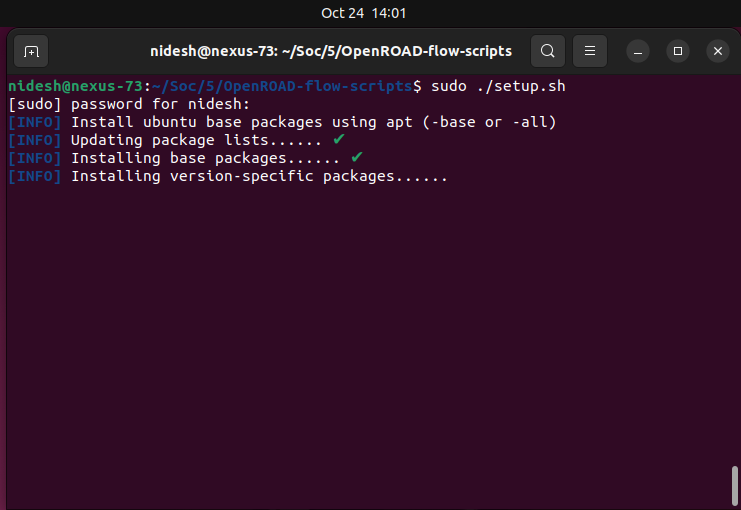
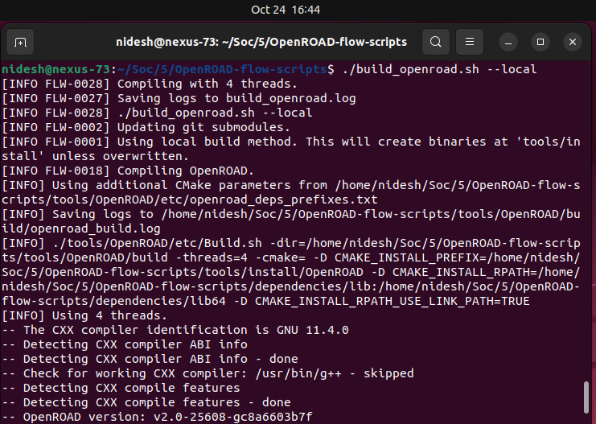
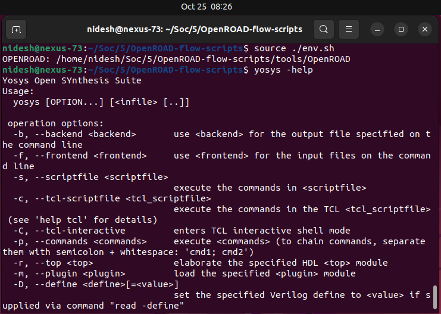
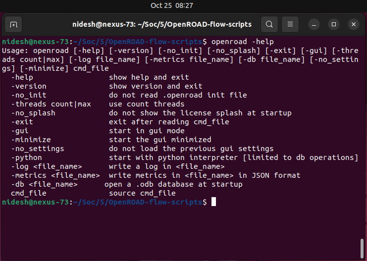
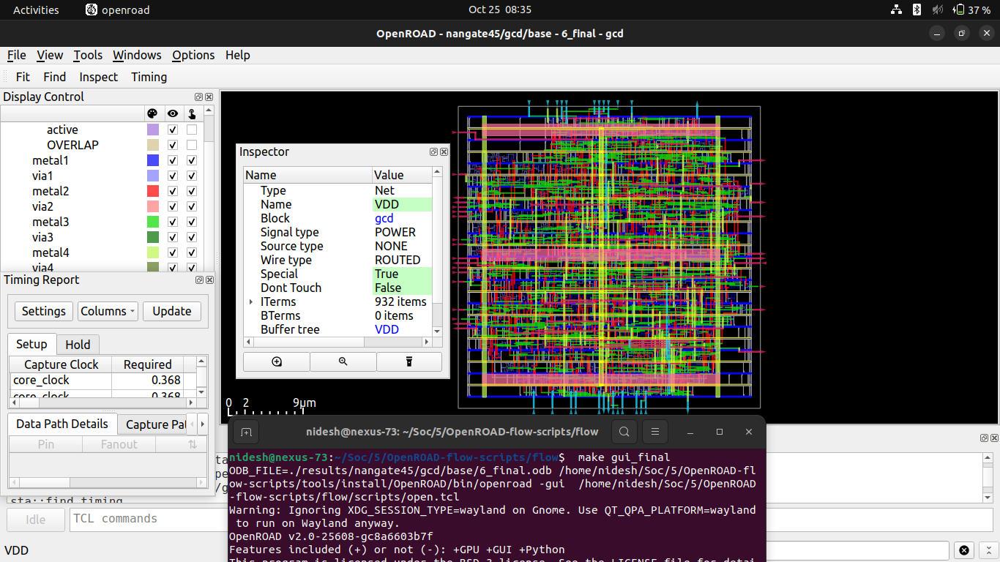
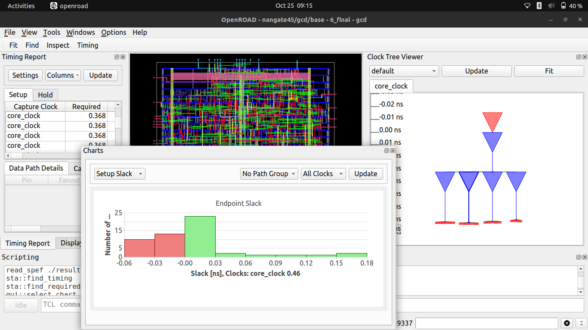
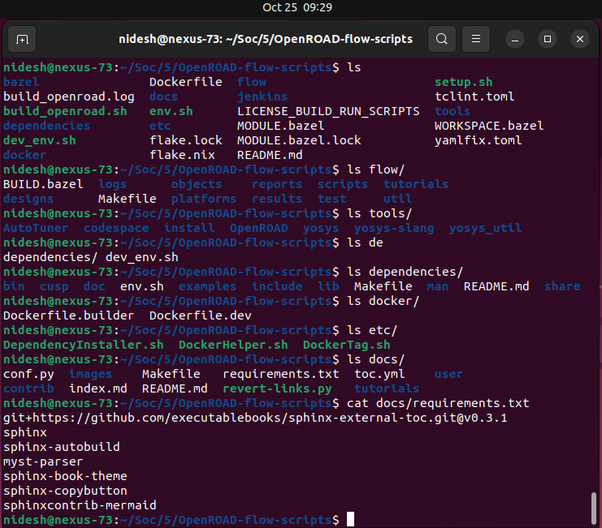
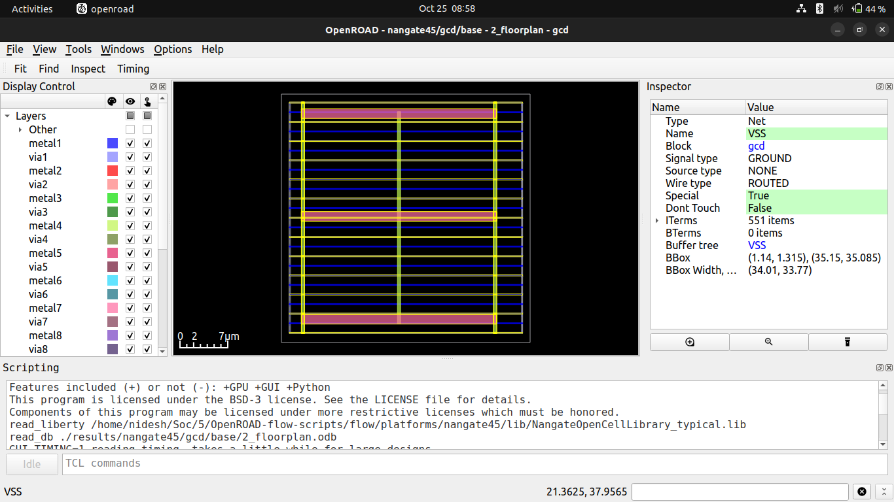
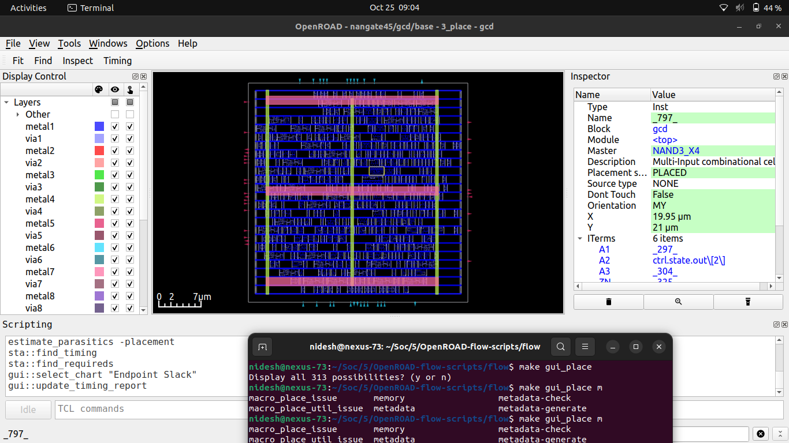

# ⚙️ Week 5 — OpenROAD Flow Installation and Floorplan + Placement

## 🧩 RISC-V Reference SoC Tapeout Program

Welcome to **Week 5** of the **RISC-V SoC Tapeout Program**, where you move from transistor-level circuit design to the **backend physical implementation flow** using **OpenROAD** — a fully automated, open-source RTL-to-GDSII system for digital IC design.

This week focuses on installing and validating the **OpenROAD Flow Scripts (ORFS)** environment and running the **Floorplan** and **Placement** stages of the design flow.

---

## 🎯 Objective

To set up the **OpenROAD Flow Scripts** environment and successfully execute **Floorplan** and **Placement** stages for a sample design.

This marks your transition from device-level simulation (Week 4) to **physical realization on silicon**, where logic gates are translated into geometric layouts.

---

## 🧠 Why This Task Is Important

After mastering SPICE-level CMOS behavior, you now see how those circuits are **placed and arranged physically** to form complete chips.

By completing this week, you’ll understand:

* How **core area and die dimensions** are defined during floorplanning.
* How **standard cells** are automatically placed to optimize area and timing.
* How **OpenROAD automates** complex backend stages in chip design.

---

## 🏗️ OpenROAD Flow Setup Steps

### 1️⃣ Clone the OpenROAD Repository

```bash
git clone --recursive https://github.com/The-OpenROAD-Project/OpenROAD-flow-scripts
cd OpenROAD-flow-scripts/
```


---

### 2️⃣ Run the Setup Script

```bash
sudo ./setup.sh
```

This installs all necessary dependencies and prepares the environment for compilation.



---

### 3️⃣ Build OpenROAD

```bash
./build_openroad.sh --local
```

This command compiles OpenROAD from source and installs the required flow binaries locally.



---

### 4️⃣ Source Environment and Verify Installation

```bash
source ./env.sh
yosys -help
openroad -help
```

Check that both `yosys` and `openroad` respond successfully — this confirms a valid installation.




---

### 5️⃣ Run the OpenROAD Flow

```bash
cd flow/
make
```

This runs the flow using built-in example designs (such as `gcd` with the Nangate45 PDK).


---

### 6️⃣ Launch the Graphical User Interface (GUI)

```bash
make gui_final
```

This opens the **OpenROAD GUI** showing the final placement and floorplan visualization.



✅ You should now see:

* The **core area** and **standard cell placement**.
* The **timing and slack charts** within the OpenROAD GUI.



---

## 📂 ORFS Directory Structure Overview

```plaintext
OpenROAD-flow-scripts/
├── docker/          → Docker-based flow setup
├── docs/            → Documentation and usage notes
├── flow/            → RTL-to-GDSII flow scripts and configs
│   ├── designs/     → Example designs (like gcd, aes, etc.)
│   ├── platforms/   → PDKs and technology files (e.g., Nangate45)
│   ├── scripts/     → Flow automation and environment setup
│   └── makefile     → Controls the step-by-step physical flow
├── tools/           → Installed EDA tool binaries
├── etc/             → Dependency management scripts
└── setup_env.sh     → Environment configuration script
```



---

## 🧩 Execution Outputs

* **Floorplan:** Core area and die boundary generated successfully.
* **Placement:** Standard cells placed within the defined core region.

## Floorplan Output



## Placement Output



---

## 🧾 Summary

This week, we:

* Installed and verified **OpenROAD Flow Scripts** on Ubuntu.
* Ran the flow up to **Floorplan and Placement stages**.
* Visualized the final layout using the **OpenROAD GUI**.

### ⚙️ Key Learnings

* Transitioned from transistor-level design to backend automation.
* Understood physical design data flow and intermediate formats.
* Observed the correlation between netlist logic and physical layout.

---

## 🪶 Reference

* [spatha0011 / VSD Hardware Design Program (Day 14)](https://github.com/spatha0011/spatha_vsd-hdp/blob/main/Day14/README.md)

---
